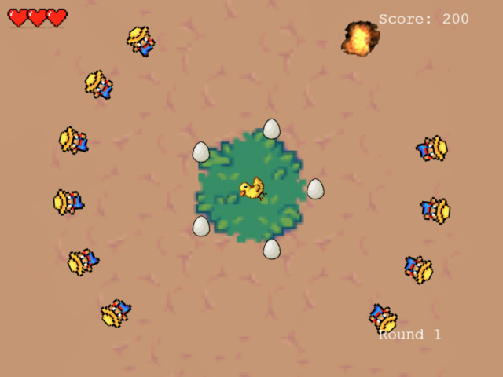

# Get quacked!

**A retro-style game built with Phaser 3 and Firebase.**

Take on the role of a fearless duck seeking revenge against hunters. Blast away at the hunters closing in on you and use your shield of eggs to protect yourself. But don't let your guard down—these hunters will stop at nothing to take you out! Can you help the duck get the ultimate revenge?

<!-- PROJECT SHIELDS -->
<!-- [![Contributors][contributors-shield]][contributors-url] -->
<!-- [![Forks][forks-shield]][forks-url]
[![Stargazers][stars-shield]][stars-url]
[![Issues][issues-shield]][issues-url] -->
<!-- [![MIT License][license-shield]][license-url] -->

[Play game](https://get-quacked.vercel.app/)

---

## About the project



We built this game as our final project for the [Northcoders](https://northcoders.com) full-stack bootcamp.

### Authors

- [lynhodinh](https://github.com/lynhodinh)
- [amparoamparo](https://github.com/amparoamparo)
- [Harry Fleming](https://github.com/tooterfish)
- [Zipeth1010](https://github.com/Zipeth1010)
- [DavidMass](https://github.com/davidcmass)

### Built with


## Getting started

### Installation

To run _Get quacked!_ locally:

1. Clone the repo

   ```sh
   git clone https://github.com/amparoamparo/get-quacked.git
   ```

2. Install NPM packages

   ```sh
   npm install
   ```

3. Run it and play!

   ```sh
   npm start
   ```

## Controls

### <kbd>Enter</kbd>

To start the game, press the <kbd>Enter</kbd> key or click on the screen.

### <kbd>←</kbd> and <kbd>→</kbd>

To rotate the duck, use the <kbd>←</kbd> (left) and <kbd>→</kbd> (right) arrow keys.

### <kbd>Spacebar</kbd>

To shoot, press the <kbd>Spacebar</kbd>.

### <kbd>A</kbd> and <kbd>D</kbd>

To rotate the shield to the left or to the right, use the <kbd>A</kbd> and <kbd>D</kbd> keys, respectively.

### High score

Made it into the leaderboard? Enter your initials by typing them in or clicking on the letters. Then press <kbd>Enter</kbd> or click on `END` to publish your score.

